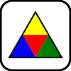

# Geometron

## Poetry Engine

The first thing to do in Geometron is to learn to operate the Poetry Engine.  The poetry engine points to any image on the World Wide Web and adds meaning to it with words placed over the image like magnets on a refrigerator.  This is a tool to impose meaning on any kind of "thing" in the most abstract possible sense, and to instantly transmit that meaning to any other person in the world.  

[click on this link to go to the poetry engine at poetryengine.html](poetryengine.html)

Now find an image on the Web and copy the link.  This is easiest to do by choosing something that comes to mind that you want to think about, look it up on [wikipedia](https://en.wikipedia.org/wiki/Main_Page), and then right clicking an image in the article that you like. When you right click an image you can select "copy image location", then go back to the browser with the Poetry Engine in it and enter that image url in the field marked "image url".  The image should instantly change to the one you selected. Now save that as the new image by clicking the save icon which is a box and a down arrow.  Now drag the mouse or slide a finger on the touch screen on the image to move words around.  Use the next and previous buttons with lines and arrows to move through the words or up and down arrows if you're using a keyboard and have the cursor in the "text" input.  Change the text and hit "enter", and save again.  Now move words around and edit them until you have created a meaning for the image.  

Save again, and notice that the larger text box is filled with [strange looking code](https://en.wikipedia.org/wiki/JSON).  Now copy all that code to the clipboard and paste it into an email or text message to another Geometron user.  They can then paste that code into the same field and click the "IMPORT" button in the very lower right corner of their screen and it will load the whole of your poem to their screen.  Ask them to send back one to you and you can import it in the same way, edit it, and send it back.  

To get back to this page, click on the scroll symbol, the left-most icon in the row of icons.

## Quantum Duality

From fundamental computer science to politics to gender, the binary models of understanding the Universe are failing.  In Quantum Duality is a philosophy engine in which we address the failures of these old numerical ideas by directly interacting with duality based on pairs of stacked images with varying opacity, which are lined up, scaled and rotated.  The math which determines the opacity of each image is identical to that of quantum superposition.  

In the quantum duality we find two images on the Web, put both links into the duality page, move them around, rotate them, scale them, and then experience the duality of them by sliding a pointer or finger on a touch screen sideways across the screen.

[Click this link to go to the quantum duality app](duality.html)

As in the Poetry Engine, copy-paste images from around the Web, such as from Wikipedia, into the image url inputs.  When you hit "enter" the image should replace the existing one.  Click the "save" icon to save the new duality.  Click the "top" or "bottom" button to select the top or bottom image.  Click "duality" to go back to duality mode.  Move a finger or drag a cursor around to move an image.   Slide a finger or drag a pointer across the scale or rotate bars to re-scale or rotate an image.  Click "save" again to save.  When you click "save" copy the text from the text area in the lower right hand corner of the screen, and text or email that to another Geometron user, who can then paste the code in the same text area and hit the "import" button to see it.  They can then interact with the duality, save a local copy, edit it, and re-export it to remix and share. 

## Marker

Markers are how we link the physical environment around us to Geometron.  They can be anything, but for the time being they will be geometric symbols painted on found objects like rocks or trash and placed outside in a public space which has some sort of local geographic meaning.  Markers form the geographic syntax of Geometron.  

In Geometron, geography is divided into two spheres: the Watershed and the Street.  Wherever you are, you got there somehow, as did all the technological artifacts you use and are surrounded by.  The fractal structure by which you and your things got there is the Street.  It includes literal roads, highways, and streets in addition to more abstract supply chains and other means of transport like stairs, ramps, shipping lanes at sea and rail lines.  

Also, wherever you are, you are in a Watershed: an ecosystem in which water flows from the sky to the sea.  Your local watershed is the fractal structure by which water flows through wherever you are.  This can include weather patterns, oceans, rivers, creeks, streams, sewer pipes, fresh water lines, springs, lakes and ponds, as well as any other artificial or natural waterways or water bodies.  

In order to understand the geographic grammar of Geometron we must first make markers.  These can be painted objects with geometric symbols on them, both large and small.  The large one will go in the physical space around us, out in a public space that can be accessed by anyone.  The smaller one will be a token like a game piece in a board game that can be placed on a laminated map of a physical space.  We will then learn to build Geometron "maps" which can be used to identify where things are in the physical space in public.  We will generalize from the map to the "deck" which is a stack of maps used to zoom in on a place and locate it globally with respect to the larger fractal structures of the Street and the Watershed.  Finally, a marker placed in a location will have a "wall" which is an open bulletin board connected to it which can be used to encode information on that thing.  We will then learn to make our first Geometron symbols and use them to make a geometric marker in a place.

We begin by getting a stack of maps.  This means taking screen shots of maps from [open street maps](https://www.openstreetmap.org/) or [google maps](https://maps.google.com) as well as photographs of a location, both the area around it and exactly where the marker object being placed is, as well as a photo of the object itself.  All these images are then uploaded to a global domain somewhere, either on a Geometron server or at an image paste site like [imgur](https://imgur.com/).  When you have a stack of images of maps and places, [go to the map editor at mapeditor.html(it's probably best to do this in a new browser window)](mapeditor.html).

In the map editor, you want to create a new element, which you do by clicking the new element symbol which looks like this:

Then save the new link by clicking the save icons which looks like this:

.   

Now go to the feed by clicking the feed icon which looks like this:

In the feed, add the urls to your images by pasting them into the field marked "Image URL" and hitting enter.  Then click back on the link to the map editor which is the "map" icon which looks like this:

In the map editor, use the "next" and "previous" buttons to scroll through the elements. You should be able to see which element is being edited by a visible border.  When you have the new link you created selected, scroll down through the images on the side of the screen until you see your images you linked to, and click on the image you want to make that map element be it.  Then click the save button again to save the current map file.  The next and previous buttons look like this:

Now click the new element button again to make another copy of that.  Scroll down through the images to the arrow and click that to get an arrow.  Save the file again with the save button, and move the arrow around with either a mouse drag for figner on touch screen. Use the scale and rotate bars to position angle and size of the arrow, always saving often.  

Having made a new map, and saved it, copy the code in the text area just below the words "import" and "reset", and save that somewhere, either on your computer or on [a remote text paste site like pastebin.](https://pastebin.com/)  Now hit the "reset" button to clear the map back to the blank default.  What you made should now be gone.  Now save the new cleared map and reload your browser.  Now paste your code back into the text box and hit the "import" button and you should see your map re-appear!  After doing that, hit the save button again and reload the browser and you should see your map back for further editing.  Now email or text message that code or a link to a paste bin of the code to someone else on the Geometron network(whoever shared all this with you), and they should also then be able to share a map with you.  

Practice making maps of all kinds: use an arrow to locate a thing on a map or in a picture, or to label a place in a picture.  Use the buttons to remove images from links, add or remove links, delete links, and move links up and down in the order. These can be used to make a totally generalized type of media which is similar to the "meme" format in viral Internet content as well as to PowerPoint slides, but with hyperlinks, and in a format which can be remixed openly on the Web by default.  To publish in the open without private data, a map can point to a physical place, which can be located relative to widely used hashtags which track the elements of the Street and Watershed network.  Those hashtags can link to a post on some commercial social media which contain links to the pastebin with the code to replicate the map.  Therefore when in a physical space with no connection to any physical networking hardware, a Geometron Operator can use hashtags to find a link, use the link to find code, and use that code in their personal Geometron server instance on their local machine to load the map using global links, then use the map to find a physical object in the location, which can then have more complex information such as clay tablets with optical encoding on them, printed material, more computer hardware, robots, etc.

Once you have mastered making and sharing maps and have shared some maps, you can generalize this to the "map deck", a sequence of "slides" each of which is a map.  You can edit this [using the deck editor at deckeditor.html.](deckeditor.html)

We will now place a painted rock, which you should have gotten from whoever shared this with you, in a public location using the Map/Deck system. Do this, in a location which you take a picture of and upload to a public url on the web.  Now [go to the "wall" from this Geometron instance by clicking on the link to wall.html.](wall.html).  You'll see a public bulletin board over an image of a place.  Edit the wall by clicking the edit icon which is a pencil as usual.  Paste the url of the image you took of your marker in a place.  Play with the numbers in the table to get the wall how you want it to be.  When you have a wall format you like, copy the code in the text area down in the lower right corner of your screen, and save that to another pastebin or local text file and again email or text it to another Geometron operator, and they'll be able to send you one as well.  Edit the wall with whatever messages you want, copy and paste them with other users.  

## Initial use of symbol app

We will now take our first steps into using the geometric language of Geometron to create symbols to use in maps.  To do this, [click on the basic symbol app at symbolapp.html.](symbolapp.html)

It is best for this to use mobile mode, which can either be a mobile phone or tablet or you can make the browser window higher than it is wide in a desk top.  Then click on some soft keys to make shapes, and make some random doodle, playing around a little with the language.  Notice that as you make symbols, you see symbol glyphs spelled out.  Also you can delete symbol glyphs with the "x" button and move your cursor around with the arrow symbols next to the delete button.  You can use a desktop with a keyboard, but that is more advanced and we'll return to that later.  For now, use this only in vertial/tablet mode. When you have a symbol you like, copy and save the text in the text area that has a sequence of numbers like "0341,0336,0333,0341,0336,0333,0341,0336,0333,0341,0336,0333,0341,0336,0333,0341,".  Send that code to another Geometron operator, and they'll send their code to you.  Paste their code in that same input area and hit "enter" and their symbol will appear.  Now paste your symbol back into the text area and hit the "save" button.  Having done that, click on the "map" icon to go back to the map editor, make a new link, and scroll down through the images and symbols until you see your new symbol.  Click on it to replace your new link by that symbol and it should appear in your map.  Save the map, drag it around, adjust it, save it again.  Now create yet another new link and click to get that to be one of your map images from before.  Save the map again and click the "move down in stack" icon a bunch of times to get the map to be on the bottom:

When the map image is below the symbol, save the map again, and move and scale the symbol how you want on the map.  Now you can see how a symbol can be created, saved, shared, and used in a map, which can point to physical objects on which the same symbol is drawn.  However, we still don't really know the Geometron language, but have just made things at random.  To understand how Geometron works we need to move on to Action Geometry, the geometry of actions based on symmetry and scale. The best way to understand this is to use the laser cut acrylic shapes provided to copy the bound book which you should have also recieved into the blank book.  

## Book of Shapes

The symbolic language used in the basic symbol app uses a set of shapes based on fundamental symmetries found in Nature.  These shapes are also laser cut using symbols made with Geometron(you'll make these later).  By using the app combined with the acrylic shapes it is possible to make geometric symbols quickly and without complex geometric constructions both with physical media and with a computer.  This allows for a network of physical objects which are mapped to digital information using symbols.  Physical things have a geometric symbol painted on them, they are placed outside in public, and Geometron maps describe them and their location with respect to the Street and Watershed networks.

To copy the book, read the existing book and simply go through it following the instructions.  The book should include instructions for making another blank bound book, also do that, as you'll need that to give to the next person who shares Geometron.  If you don't have the laser cut shapes it it should be possible to get printed, cut, and laminated paper shapes.  Later, you'll be able to use Geometron to design your own laser cut shapes from scratch then use the network of laser cutters to get your shapes cut out to pass on to other new operators of Geometron.

## Geometron Hypercube and Virtual Machine

In this section we will learn the structure of Geometron.  This is not for everyone.  But we will attempt to make it as non-technical as possible. 

make the keyboard, ascii, action tablet, physical hypercube stack, printed and copied from hypercube handed to you by someone, 

edit keyboard, paint keyboard, use to make icons and symbols, learn about the hypercube, edit one and share it with others, share all elements created, share keyboard, buy new keyboard, print and laminate tablets: 

- 00 - 037: root magick
- 040-0176:ASCII
- 0177: do nothing
- 0200-0277: shapes
- 0300-0377: 2d geometry actions
- 0400-0477: machine actions
- 0500-0577: machine shapes
- 0600-0677: 3d shapes
- 0700-0777: 3d geometry actions
- 01000-01777: symbols for 0-0777(second cube)

## Making Symbols using the full Geometron

Use the app to make complex symbols, make symbols for markers, integrate into physical network.  Use shapes from AG book to make markers, use s

make icons, save them, load them, share them

some example symbols and how to make them

how to edit shape tables ets

## Scrolls

edit this scroll to make a more specific replication for next instance, save that in a paste bin.

Create a new scroll, edit it, paste it, share it, let other edit, how to do math papers, link to srs scroll

## Build a web page on index.html

links to learn all the types of code, to how code fits together, the 5 alchemy elements of geometron code, how editor.php works.  At minimum, though, just make a link to something 

## build your own laser cut shapes

nuts and bolts of buying them, finding maker spaces, hooking up with artist

Use main geometron editor to create shapes, both svg and png, save, email to someone with laser cutter(or ponoko) and get shapes, more than you need, give them to people, including whoever sent you the system

## make patterns in clay

set up the robot, connect it all, edit the code, or have someone else set it all up and test it all.  When totally set up by someone else, put soft modeling clay on build stage, flatten it, and use a nail to make simple patterns and write words.  Copy code and share with other users, send code of symbol to whoever sent you the system.  Repeat with sculpey, bake, and paint, then share the tablets with whoever sent you the system and also whoever you're sending new systems to

## Build your own language in the clay

edit machine-specific hypercube, document it, share it, use it to make 3d objects

## Build a new robot and share it with others

- gather wires, connectors, pcb's, pi parts, cardboard, box cutter, glue and tape, plastic sheet, magnets, nails, salvaged buttons, lipo battery, pi screen and periferals
- find dvd drives, take them apart, solder wires on
- assemble probe with cardboard, epoxy, tape, plastic, probe, electronics, pi
- edit the code to make it work, test it out, set it up, repeat all tests, share it with someone else

## Build a local instance not on a pi 

take old hardware, delete everything, install linux.  install apache and php then install geometron server, put on wifi, host.  When this is done, release the hardware from the private property system and pass it out into the community using the physical marker network.  Hardware can be simply released.  The Geometron Educational foundation can take donations for the hardware and labor to convert it, and the operators in the foundation simply release all this freely to communities.  This should be possible on macs, pc's, androids, chromebooks.

## build a localhost instance, link to github

## Build an instance on a free or paid web host

## Improve the system and replicate it

What you see in the edit screen(after clicking the edit icon) here is "markdown", which is language which allows people to publish things on the web without learning more complex languages. Hit return twice to get a paragraph break.  Copy the syntax you see here to get links and images and headings. You can look up markdown ([cheat sheet](https://www.markdownguide.org/cheat-sheet/), [detailed guide](https://daringfireball.net/projects/markdown/syntax), [wikipedia entry](https://en.wikipedia.org/wiki/Markdown)) for more syntax.  Also embedding HTML works if you know that.  

[Geometron Symbols](symbol/): 

[Create a fork](fork.html):

Enter the name of the new page you want to create and click through the links to get to a new page one level down from this one.  Repeat this in the "new map" field to make a new map, which is a stack of images, symbols, words and links in a general web page layout.  Each Geometron page has a scroll and a map.  The "main" page can be either a scroll or map.  To see the map, click on its symbol, and to edit it click the edit icon from the map screen. The default map shows what the symbols mean that are used for editing.  To see the current map value go to [data/currentmap.txt](data/currentmap.txt).  Also, this JSON file can be edited directly using editor.php(see link below).  Inventory is used to track inventory at a given factory or page.  

[Map](map.html):

Maps are a stack of web elements(images, symbols, words, links) arranged geometrically on a page.  The Map page contains an editor for adding and deleting elements, moving them around, rotating them, changing their images, symbols, words and links and changing the order in which they are stacked.  Click the edit button in the map page to edit it. Most pages in the Geometron Art Factory system have links to a map and also a scroll.  Some pages default to a map and others to a scroll, but in general all pages have both.

Pages like this need to be *hosted* on some kind of *web server*.  This can be on a free web hosting service, on a purchased domain with paid hosting, on a local wifi network only other people on that network can see, run locally on a single machine, or run on server clusters in decentralized Internet infrastructure as the network starts to scale up.

A word of warning: all Geometron servers are world-writeable and world-readable by default, with no user or login or password control.  Put nothing on any Geometron server which is private, personal or proprietary.  Do not integrate these pages into existing pages where you care about security.  The risks of a totally world-writeable and world-readable network go away if we put no money or property or personal information on the Network. And that is precisely how this Network is built: as a self-replicating shared art resource on which people can co-create art and instantly publish it both to the Web(both the centralized Web and the Geometron network).  If you want something to survive over time without being changed or deleted, copy it to places that won't get deleted like a local private hard drive, a Github repository or a pastebin paste.

What follows are some of the technical details of how to actually replicate this.  This part will be overly technical for people not used to working with the internals of Internet stuff.  If you ask around you can probably find someone who knows how to follow these instructions, though, and work together with them to build an instance of the Geometron Art Seed without digging into the very technical stuff yourself. Find someone into web things, sign both of you up for the mailing list and we'll get you set up with the more obscure details of making a new instance work.

<h3 style = "background-color:#ffbfbf">Technical Details Below This Line</h3>

[edit code with editor.php](editor.php)

All instances are replicated with a program called replicator.php, which uses a file called dna.txt to fetch all the files needed to run an instance.  These are a collection of html, javascript and php programs as well as some Geometron data which make up a copy of this whole webpage.  The entire system when copied is between 1 and 2 megabytes, and will run on any server with php installed, which is most servers.

The Github repository from all this is generated is:

[https://github.com/lafelabs/thing/](https://github.com/lafelabs/thing/)

To run the replicator, copy the code in [this file](https://raw.githubusercontent.com/LafeLabs/thing/master/php/replicator.txt) or use the [local copy of the file here](php/replicator.txt) to a file called replicator.php in whatever directory on the server you want to copy Geometron.  Run that file by pointing your browser to [your server url]/replicator.php, then click on the link you see.  After that you can click on the "fork" icon and navigate down to "symbol/" and click on that replicator as well to replicate the Geometron symbol creation page.

To start a new Geometron web server get free web hosting at [infinityfree.net](https://infinityfree.net/) or [000webhost](https://www.000webhost.com/) or buy a domain and get paid hosting at a company like [dreamhost](https://www.dreamhost.com/), or get a [Raspberry Pi](https://www.raspberrypi.org/), install [Apache and php](https://www.raspberrypi.org/documentation/remote-access/web-server/apache.md) on it and do the same copying of replicator.php.  Build a Raspberry Pi terminal with a screen, keyboard, mouse and power supply(this can be bought as a kit or built up from a pi motherboard and found components from other systems), put it on a local WiFi network, figure out the IP address of it, and link to that from local networks to make physically local Geometron Page only available on local wifi. 

Here are the commands to install everything on the pi:

<pre>
sudo apt update
sudo apt install apache2 -y
sudo apt install php libapache2-mod-php -y
</pre>

To get to web directory, copy replicator.php, run it, change permissions, and get your local IP address use the following commands from the terminal:
<pre>
cd /var/www/html
sudo rm index.html
sudo curl -o replicator.php https://raw.githubusercontent.com/LafeLabs/thing/master/php/replicator.txt
php replicator.php
sudo chmod -R 0777 *
hostname -I
</pre>

Once you have a IP address of a local server, put a link to that address on some global server so that without remembering the IP address or putting it in manually you can go to an existing server and just click to get to the local one.  If this is in a public place and you wish to share, you can then paint some physical thing with the address of the global page (www.yournewdomain.xyz), and edit the main top level scroll of that page to have the link to the local server be at the top, with some clear description or image(a picture of the physical server is not a bad idea).  

To set up a raspberry pi server, you can run it headless but you need a TV or monitor that has HDMI input with an HDMI, a mouse and a keyboard.

- [pi 4 b 40 dollars](https://www.sparkfun.com/products/15446)
- [micro hdmi converter 6 dollars](https://www.sparkfun.com/products/15796)
- [wall plug power for pi 4 8 dollars](https://www.sparkfun.com/products/15448)
- [micro sd card, 16 gb, 20 dollars](https://www.sparkfun.com/products/15051)

so to buy the whole pi server and set it up headless if you have basic computer stuff around like a screen, keyboard and mouse is about 75 dollars.  If you have to buy a screen, keyboard and mouse that probably adds 50 + 10 + 10 = about 70 dollars, then add a large lipo battery pack with usb c power cable for another 30-50 dollars or as high as 100 with a solar panel.  So the total cost for a fully portable system is in the range of 200 dollars.

 [robot.html](robot.html)

the robot needs a button added to "run" the python robot program.  this should be added in the same script as the off button(off button is on pin 3), both of which need to be run on boot, instructions for adding these are found here:

[https://howchoo.com/g/mwnlytk3zmm/how-to-add-a-power-button-to-your-raspberry-pi](https://howchoo.com/g/mwnlytk3zmm/how-to-add-a-power-button-to-your-raspberry-pi)

copying directly the instructions above works on GPIO 2 with the following code for the two programs that replace those used in that tutorial:

## listen-for-go-button.py:

<pre>
#!/usr/bin/env python

import RPi.GPIO as GPIO
import subprocess

GPIO.setmode(GPIO.BCM)
GPIO.setup(2, GPIO.IN, pull_up_down=GPIO.PUD_UP)
while True:
	GPIO.wait_for_edge(2, GPIO.FALLING)
	subprocess.call('python /var/www/html/robot.py', shell=True)
</pre>

## listen-for-go-button.sh:

<pre>
#! /bin/sh

### BEGIN INIT INFO
# Provides:          listen-for-go-button.py
# Required-Start:    $remote_fs $syslog
# Required-Stop:     $remote_fs $syslog
# Default-Start:     2 3 4 5
# Default-Stop:      0 1 6
### END INIT INFO

# If you want a command to always run, put it here

# Carry out specific functions when asked to by the system
case "$1" in
  start)
    echo "Starting listen-for-go-button.py"
    /usr/local/bin/listen-for-go-button.py &
    ;;
  stop)
    echo "Stopping listen-for-go-button.py"
    pkill -f /usr/local/bin/listen-for-go-button.py
    ;;
  *)
    echo "Usage: /etc/init.d/listen-for-go-button.sh {start|stop}"
    exit 1
    ;;
esac

exit 0
</pre>

pinout to jumpers from pi header :

[here is a digikey cart with a bunch of the robot parts](https://www.digikey.com/short/zzj087)

The longer term road map for the Geometron Art Factory network is to install server clusters locally in every basement of every library, school, town hall, church, coffee shop and office park, locally owned by the people in that local community who get value from it.  Ultimately this can completely replace the centralized Internet, with physical hardware all controlled by the people who benefit from that network in the local physical world near those servers.

To create a new fork of the code, go to a UNIX command line with PHP installed, go into a new directory which is linked to a new github repository, copy replicator.php into that directory, run the program, then start php's built in web server as follows and type from the command line:

<pre>
curl -o replicator.php https://raw.githubusercontent.com/LafeLabs/thing/master/php/replicator.txt
php replicator.php
php -S localhost:8000
</pre>

 and navigate your browser to localhost:8000, then edit using editor.php, change references in replicator.php to your new repo address, and replicate from the new fork by changing the code in replicator.php.  Note that php code needs to be made live by cliking on txt2php.php from editor.php.  This will work on macos or linux with very minimal effort, and requires adding the Ubuntu command line or installation of [MAMP](https://www.mamp.info/en/) to work on Windows 10.  

Edit the code for any page using the *editor*, another thing all instances have:

[editor.php](editor.php)

When you have created your own modifications of the code, push that to your own Github repository and change the links in replicator.php to links to the global link to the raw text for your own dna.txt file and symbol/php/replicator.txt in your new repository and all future instances will be generated from your code instead of this instance.  Any php files you edit using editor must be converted from .txt to .php by running text2php.php by clicking on the link to that program from the Editor.  If you add new files, you can add them to dna.txt by clicking dnagenerator.php.  Note that *all* files in the system can be edited. 

To learn the skills needed to [hack](https://en.wikipedia.org/wiki/Hacker_culture) the code to your purposes, you need to learn JavaScript, HTML, and some PHP, all of which are best learned from [https://www.w3schools.com/](https://www.w3schools.com/).

Note that in the Geometron system we associate the basic Five Languages with the Five Elements as follows: Fire = JavaScript, Air = CSS, Water = HTML, Aether = PHP, and Earth = Geometron. 

## Elements of Geometron

- collection of code found here
- walls
- poetry engines
- maps
- decks
- books
- laser cut shape sets
- icon factories
- laser cut shape factories
- raspberry pi servers
- virtual machines inside intranets
- hosted web servers
- code editors
- scrolls
= trash printers
- printed clay tablets
- postcards with geometron printed with laser cut shapes
- physical markers in physical places
- other machine elements based on arduino: motors, pumps, other robotics, display, electrochemical probes, temperature regulation systems
- Geometron hypercube
- Geometron virtual machine

## Actions

- build graphical poem
- build quantum duality
- build webpage using index.html and html editor
- create and edit a scroll 
- build a marker with a wall
- build a map deck to the marker
- write the book Action Geometry based on the existing copy using the shape set
- bind a blank book
- create symbols using geometron, learn the motions, symmetries and scales and actions and put the symbols in a map
- upload and edit an icon
- replicate geometron thing to local hard drive, edit on localhost, push to a new github
- replicate geometron to a free or paid webhost
- build a raspberry pi geometron web server and install it
- build a custom shape table, your own graphical language, save, publish, and share
- build a custom font, save and share
- understand the Geometron hypercube and Geometron Virtual Machine, edit the hypercube
- program the robot to make simple marks, writing
- use the robot to make sculpey tablets, bake them, paint them
- build robot including pi, pi hat, buttons and switches, battery, cables, dvd drives, bent plastic, magnets, nail, cardboard
- design your own laser cut shape set and ruler, get them made at ponoko or local maker space or some artist
- build laminated maps of your Street and Watershed
- use voxel coding to make glitch art in 3d

## trail map of future 

- implement geometron in direct control of pixels in screen
- build the physical hardware to do this from found materials and clay fabrication interconnects
- build trash-sourced power generation and storage to run the system
- goal is to have full Geometron Web with links and pages, servers and clients with bitmaps and geometron vectors with 100% trash and found materials input, no money or mining or property at all, including physical network infrastructure by way of point to point optical etc.  

## next tasks in trail map

- get fabrication working in river clay with a bake step directly after writing
- get a copper/solder slurry or something like it to work for circuit fabrication in clay 
- use this to make complex circuits with smt land pads, develop techniques for using found chips from other boards and clay interconnects to upcycle functional technology, integrate into rocks and other clay using river clay
- build nonlinear circuits with clay electronics and various materials like fluids and found nonlinear things to build bottom-up active eletronics
- develop a trash-sourced energy storage system using aluminum beverage cans and charcoal(aluminum-alumina-carbon cycle)
- smooth out the robot control hypercube editing
- give away enough robots to enough people who will replicate that replication becomes exponential without any further investment
- build up all CJK characters in geometron by building strokes then simple radicals, more complex radicals and compound characters in a fractal way
- get some system working for printing tablets which can be easily optically scanned in using a browser
- use levers to step down scale of stage motion 

## Physical Kit

- raspberry pi geometron server connected to trash robot
- some sculpey
- some crayola modeling clay
- baked and painted clay tablets
- shape set in cloth bag
- geometron ruler
- postcard with symbol on it
- completed Action Geometry book
- blank AG book
- sewing needle and thread, push pin
- painted stones with symbols on them
- laminated maps of watershed and street

