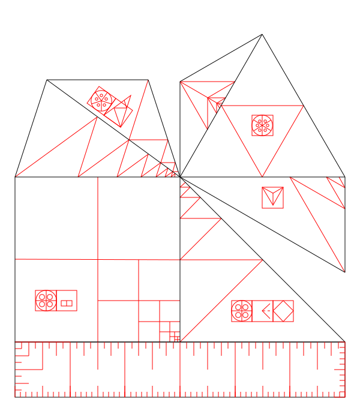
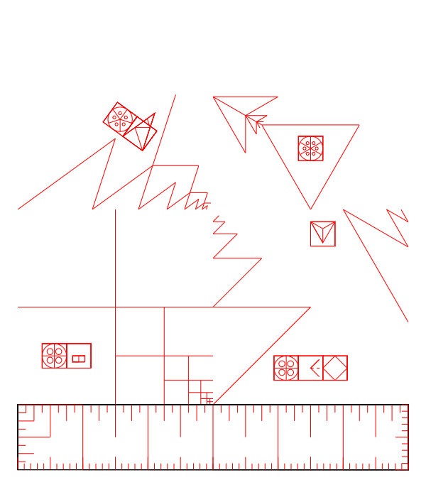

# Action Geometry

Download this svg file to print the set via [Ponoko.com](https://www.ponoko.com):

Or download these two files, the png and the svg to cut out on Dremel laser cutter.

Print these stencils on any laser cutter to spray the stencils to replicate the set:

Click to replicate Platonic Solids ArtBox:

 - [SYMBOL](symbol.html)
 - [VOXEL](voxel.html)
 - [editor.php](editor.php)
 - [dna generator](dnagenerator.php)

