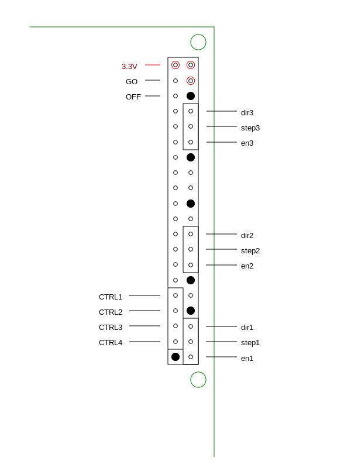

# Replicate a Raspberry Pi Geometron server

## Tools:

- SD card reader
- HDMI cable
- keyboard
- mouse
- HDMI display like a TV or small screen
- soldering iron

## Feedstock

- Pi 3 B+ or 4
- 16 gigabyte SD card
- USB A to USB Micro for 3 or USB C for 4
- wall wort to USB A with over 2 amps or USB battery with 12 V connection
- battery with barrel connector to drive robot or 12V wall plug which converts barrel gender, charger for battery, wall and/or solar
- cardboard and duct tape
- push buttons
- [potentiometer-adjust MP6500 stepper driver](https://www.pololu.com/product/2966)
- solder
- 4 pin headers for pi hat board
- pi hat boards
- 40 pin headers for pi hat board
- optional switch and pilot light
- optional breakout wires for control pins to arduinos
- DVD or CD drives(3) or other linear stepper motor stages
- 4 wire samtecs from stripped tinned leads to female or female to female and male headers to break out on motors
- gorilla epoxy, elmers glue, JB weld
- modeling clay and sculpey
- plastic trash sheet(polyprpelyne) 
- magnets
- nails

## Tasks

- buy or scavenge everything, store it, distribute it(supply chain within geometron network)
- [flash images onto SD cards](https://www.raspberrypi.org/documentation/installation/installing-images/)
- do the geometron-specific software setup described here
- assemble electronics--solder parts on, rotate potentiometer all the way to the left
- assemble cardboard chassis
- mount stages on cardboard, mount cardboard on stages
- cut plastic, bend it, mount it on cardboard and add magnets and nail
- use meter to find right wire pairs, connect 4 wire samtec 
- change robotExists from False to True in robot.py
- connect everything and run tests of basic x,y,z motions 
- put soft modelling clay under nail probe, flatten it, use robot controls to set height, do test prints of lines, squares, words
- make prints of symbols and words on slabs of sculpey, bake, paint, epoxy to rocks, distribute into public spaces with geometron maps to locate them
- improve all elements of system, document improvements, merge with main project or fork and replicate
- replicate the whole system again, pass it along to another user and guide them to replicate another one after that
- solicit donations from people of parts, tools, materials
- build more robots, release them into public spaces with maps that guide users to them and from them to more robots and more robot factories
- develop and use clay and metal circuit fabrication to make interconnects to use all-upcycled technology for the whole system, including energy generation, storage, motor control, and geometron server, ultimately building full bottom-up electrical fabrication

Buy a raspberry Pi 3 B+ preferably but 4 also works.

Buy 16 gigabyte SD card and SD card reader

Here are the commands to install everything on the pi:

<pre>
sudo apt update
sudo apt install apache2 -y
sudo apt install php libapache2-mod-php -y
</pre>

To get to web directory, copy replicator.php, run it, change permissions, and get your local IP address use the following commands from the terminal:
<pre>
cd /var/www/html
sudo rm index.html
sudo curl -o replicator.php https://raw.githubusercontent.com/LafeLabs/thing/master/php/replicator.txt
php replicator.php
sudo chmod -R 0777 *
hostname -I
</pre>

Once you have a IP address of a local server, put a link to that address on some global server so that without remembering the IP address or putting it in manually you can go to an existing server and just click to get to the local one.  If this is in a public place and you wish to share, you can then paint some physical thing with the address of the global page (www.yournewdomain.xyz), and edit the main top level scroll of that page to have the link to the local server be at the top, with some clear description or image(a picture of the physical server is not a bad idea).  

To set up a raspberry pi server, you can run it headless but you need a TV or monitor that has HDMI input with an HDMI, a mouse and a keyboard.

- [pi 4 b 40 dollars](https://www.sparkfun.com/products/15446)
- [micro hdmi converter 6 dollars](https://www.sparkfun.com/products/15796)
- [wall plug power for pi 4 8 dollars](https://www.sparkfun.com/products/15448)
- [micro sd card, 16 gb, 20 dollars](https://www.sparkfun.com/products/15051)

so to buy the whole pi server and set it up headless if you have basic computer stuff around like a screen, keyboard and mouse is about 75 dollars.  If you have to buy a screen, keyboard and mouse that probably adds 50 + 10 + 10 = about 70 dollars, then add a large lipo battery pack with usb c power cable for another 30-50 dollars or as high as 100 with a solar panel.  So the total cost for a fully portable system is in the range of 200 dollars.

 [robot.html](robot.html)

the robot needs a button added to "run" the python robot program on GPIO2.  this should be added in the same script as the off button(off button is on pin 3), both of which need to be run on boot, instructions for adding these are found here:

[https://howchoo.com/g/mwnlytk3zmm/how-to-add-a-power-button-to-your-raspberry-pi](https://howchoo.com/g/mwnlytk3zmm/how-to-add-a-power-button-to-your-raspberry-pi)

But are repeated here:

# shutdown button installation:

<pre>
sudo nano listen-for-shutdown.py
</pre>

## listen-for-shutdown.py:

<pre>
#!/usr/bin/env python

import RPi.GPIO as GPIO
import subprocess

GPIO.setmode(GPIO.BCM)
GPIO.setup(3, GPIO.IN, pull_up_down=GPIO.PUD_UP)
GPIO.wait_for_edge(3, GPIO.FALLING)

subprocess.call(['shutdown', '-h', 'now'], shell=False)

</pre>

move the file and make it executable:

<pre>
sudo mv listen-for-shutdown.py /usr/local/bin/
sudo chmod +x /usr/local/bin/listen-for-shutdown.py
</pre>

make the shell script:

<pre>
sudo nano listen-for-shutdown.sh
</pre>

## listen-for-shutdown.sh:

<pre>
#! /bin/sh

### BEGIN INIT INFO
# Provides:          listen-for-shutdown.py
# Required-Start:    $remote_fs $syslog
# Required-Stop:     $remote_fs $syslog
# Default-Start:     2 3 4 5
# Default-Stop:      0 1 6
### END INIT INFO

# If you want a command to always run, put it here

# Carry out specific functions when asked to by the system
case "$1" in
  start)
    echo "Starting listen-for-shutdown.py"
    /usr/local/bin/listen-for-shutdown.py &
    ;;
  stop)
    echo "Stopping listen-for-shutdown.py"
    pkill -f /usr/local/bin/listen-for-shutdown.py
    ;;
  *)
    echo "Usage: /etc/init.d/listen-for-shutdown.sh {start|stop}"
    exit 1
    ;;
esac

exit 0
</pre>

Move it and make it executable:

<pre>
sudo mv listen-for-shutdown.sh /etc/init.d/
sudo chmod +x /etc/init.d/listen-for-shutdown.sh
</pre>

register to run on boot:

<pre>
sudo update-rc.d listen-for-shutdown.sh defaults
</pre>

and start it now:

<pre>
sudo /etc/init.d/listen-for-shutdown.sh start
</pre>

# Go Button:

<pre>
sudo nano listen-for-go-button.py
</pre>

## listen-for-go-button.py:

<pre>
#!/usr/bin/env python

import RPi.GPIO as GPIO
import subprocess

GPIO.setmode(GPIO.BCM)
GPIO.setup(2, GPIO.IN, pull_up_down=GPIO.PUD_UP)
while True:
	GPIO.wait_for_edge(2, GPIO.FALLING)
	subprocess.call('python /var/www/html/robot.py', shell=True)
</pre>

move the file and make it executable:

<pre>
sudo mv listen-for-go-button.py /usr/local/bin/
sudo chmod +x /usr/local/bin/listen-for-go-button.py
</pre>

make the shell script:

<pre>
sudo nano listen-for-go-button.sh
</pre>

## listen-for-go-button.sh:

<pre>
#! /bin/sh

### BEGIN INIT INFO
# Provides:          listen-for-go-button.py
# Required-Start:    $remote_fs $syslog
# Required-Stop:     $remote_fs $syslog
# Default-Start:     2 3 4 5
# Default-Stop:      0 1 6
### END INIT INFO

# If you want a command to always run, put it here

# Carry out specific functions when asked to by the system
case "$1" in
  start)
    echo "Starting listen-for-go-button.py"
    /usr/local/bin/listen-for-go-button.py &
    ;;
  stop)
    echo "Stopping listen-for-go-button.py"
    pkill -f /usr/local/bin/listen-for-go-button.py
    ;;
  *)
    echo "Usage: /etc/init.d/listen-for-go-button.sh {start|stop}"
    exit 1
    ;;
esac

exit 0
</pre>

Move it and make it executable:

<pre>
sudo mv listen-for-go-button.sh /etc/init.d/
sudo chmod +x /etc/init.d/listen-for-go-button.sh
</pre>

register to run on boot:

<pre>
sudo update-rc.d listen-for-go-button.sh defaults
</pre>

and start it now:

<pre>
sudo /etc/init.d/listen-for-go-button.sh start
</pre>

pinout to jumpers from pi header :

