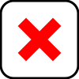
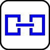

# Maps

The Map is a generalization of the Poetry Engine and is one of the most universal types of file in Geometron. A map is like a "meme" or a slide in a presentation, but also like a map in geography.  It is a generalized type of document where images, links and text are arranged on top of each other.  Images can be external links on the web or locally uploaded images or symbols created using the Geometron symbolic language.  This ability to instantly integrate symbols into maps is a big part of what makes the Geometron symbolic language powerful. 

As with the poetry engine, you can drop code into a map and then see that map.  We will start by doing that, copying and pasting the map code here into the text input at the lower right corner of the screen and hitting the "import" button.

<pre>
[
    {
        "x": 0.35083532219570407,
        "y": 0.3818615751789976,
        "w": 0.45465393794749404,
        "angle": 0,
        "text": "scroll.html",
        "href": "scroll.html",
        "src": "iconsymbols/scroll.svg"
    },
    {
        "x": 0.08711217183770883,
        "y": 0.07517899761336516,
        "w": 0.45465393794749404,
        "angle": 0,
        "text": "click scroll icon to return to scroll",
        "href": "",
        "src": ""
    },
    {
        "x": 0.20405727923627684,
        "y": 0.18138424821002386,
        "w": 0.27088305489260145,
        "angle": 52,
        "text": "scroll.html",
        "href": "scroll.html",
        "src": "iconsymbols/arrow.svg"
    }
]
</pre>

Copy/paste that code by going to the map viewing page at [map.html](map.html).  Then click the scroll icon to return to the scroll editor and the button to get to the map scroll to get back to this document.

Now, to make our own maps, we'll use the map editor, which you can open in a new browser window at [mapeditor.html](mapeditor.html).  Also note that the symbol in Geometron for map is this:

Once you're looking at the map editor, you can go through the elements with the next and previous icons:

The map icon will get you back to the actual map.  

To create a new element, click the new element symbol which looks like this:

Then save the new link by clicking the save icons which looks like this:

.   

To see that it saved, reload the browser and you should now see your new, duplicated link.  Now delete that link with the delete icon here:

To move the link around slide it around with your finger or click-drag with a mouse or other pointer around the screen.  To scale and rotate slide a finger or drag a cursor along the slider bars in the lower right corner of the screen.  

To move a link up or down in the ordering of the elements, use the "move element up" and "move element down" icons shown here:

To change the text, link or image you can manually paste those into the fields in the text table.  You can also select the feeds of images, text or links by clicking on their icons, then click an image, link or text to make the current link that.  These symbols are these:

To remove the image or link part of a "link" click the icons with the red "x"'s to remove them.  To see the feeds of text, links, and external image urls go to the feed, the symbol for which is 

In the feed, add the urls to images from the web by pasting their url(right click on any image and "copy image url") into the field marked "Image URL" and hitting enter.  Text is entered into the feed similarly as are links. In all cases the elements of the feed are deleted by clicking the red "x" icon.  Now go back to the map editor and click on an image, and it will replace the 

Having made a new map, and saved it, copy the code in the text area just below the words "import" and "reset", and save that somewhere, either on your computer or on [a remote text paste site like pastebin.](https://pastebin.com/)  Now hit the "reset" button to clear the map back to the blank default.  What you made should now be gone.  Now save the new cleared map and reload your browser.  Now paste your code back into the text box and hit the "import" button and you should see your map re-appear!  After doing that, hit the save button again and reload the browser and you should see your map back for further editing.  Now email or text message that code or a link to a paste bin of the code to someone else on the Geometron network(whoever shared all this with you), and they should also then be able to share a map with you.  

Practice making maps of all kinds: use an arrow to locate a thing on a map or in a picture, or to label a place in a picture.  Use the buttons to remove images from links, add or remove links, delete links, and move links up and down in the order. These can be used to make a totally generalized type of media which is similar to the "meme" format in viral Internet content as well as to PowerPoint slides, but with hyperlinks, and in a format which can be remixed openly on the Web by default.  To publish in the open without private data, a map can point to a physical place, which can be located relative to widely used hashtags which track the elements of the Street and Watershed network.  Those hashtags can link to a post on some commercial social media which contain links to the pastebin with the code to replicate the map.  Therefore when in a physical space with no connection to any physical networking hardware, a Geometron Operator can use hashtags to find a link, use the link to find code, and use that code in their personal Geometron server instance on their local machine to load the map using global links, then use the map to find a physical object in the location, which can then have more complex information such as clay tablets with optical encoding on them, printed material, more computer hardware, robots, etc.

