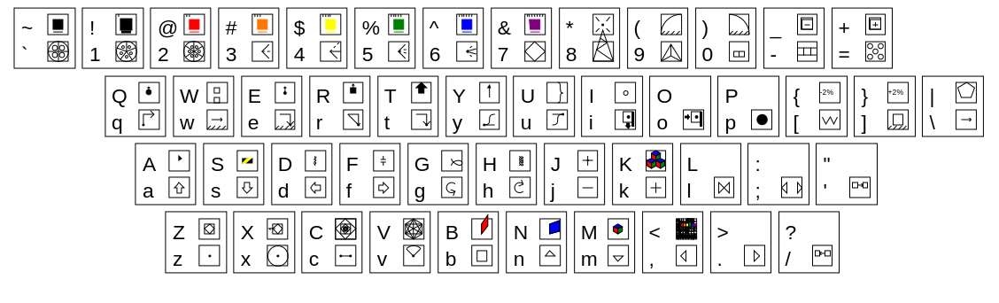

# Geometron 5

In order to learn the Geometron language  you should have a Geometron keyboard, decorated with a subset of the following symbols:

To buy a cheap and small USB keyboard to decorate try [this one from Amazon](https://www.amazon.com/gp/product/B01IQL2VCE/).  I recommend Sharpie paint pens, which can also be [bought on Amazon](https://www.amazon.com/Sharpie-37371PP-Oil-Based-Markers-Assorted/dp/B000GOYAPQ/).  Most keyboards and black, so white or yellow are the best choices for contrast.  Just add symbols as you learn them as you go through this tutorial, so your keyboard does not get too cluttered right away.  

To start learning Geometron click on the Geometron icon from this page which looks like this:

Then move the cursor around by using the keys "asdfghjk".  The cursor looks like this:

 The cursor movements have symbols that look like this:

As you type, symbol glyphs appear in the spelling field of the screen. Use arrow keys and delete or backspace key(probably backspace, try that first) to move through the symbols and edit.  Try doing some motions, then deleting them. The symbols for these edit actions are:

Now try adding the drawing actions, circle, arc, square etc, using the keys shown here "zxcvbp]\":

Draw things, delete them, try editing what you draw.  By now you should see how Geometron works: it is a language that consists of sequences of discrete geometric actions, like move, rotate, scale etc.  This should be enough to make some basic shapes, like the one you start out with, some simple sets of circles.  To save your graphics, click the "save" icon which looks as it does for the Geometron Map editor:

When you've saved your symbol you can go see the file on the Symbol Feed, which you get to by clicking on its icon which looks like this:

Note that you can always delete whatever you draw by clicking the delete icon which looks like this:

To save your file right click on it on your browser and save it locally. You will always see two image in the feed when you save an image, one of which is in svg format the other is in png.  The png is a bit map and the svg is vector graphics.  But the an important fact for Geometron is that the svg files saved using this system save both the symbol and all the code that describes what you drew using the Geometron language.  So you can always edit any file made using this system on any other server running Geometron.  To edit an svg, click on it, then click the edit button from the Feed:

And go back to the main edit screen.  If you want to do this on a file from another server, go to that servers feed, download the file, then use the file uploader to upload it to the feed on your server.  Then click on it, hit the edit button and go to the main edit page to edit it on your server.  Hence, as in the initial discussion of organic media in the Geometron network, all files can be edited, replicated, and deleted quickly across the whole Web from sever to sever if many computers are running this software.  

Next we can play with styles, colors and layers.  There are 8 layers in Geometron, each of which has its own linewidth, line color and fill color the user can set.  To change layers use the upper-case commands across the top row of a qwerty keyboard:

To change the layer properties click this icon to go to the style editor:

Now we can dig into what is really the heart of Geometron: symmetries and scales.  Symmetry sets what the rotation angle is of the cursor.  The most common ones are 4 fold(90 degrees), fivefold(72 degrees) and sixfold(60 degrees).  Then there are actions which divide the angle by 2, multipley by 2, divide by 3 and multiply by 3.  These commands are as follows:

The "scale" in Geometron is the factor by which the cursor is changed in size when you zoom in or out.  By default this is 2.  However, there are some other scales that are extremely useful.  We need the square root of 2 to deal with the diagonal of 45 degree figures, the Golden Ratio to deal with fivefold symmetry(e.g. making a pentagon with a pentagram in it), and the square root of 3 to deal with 3 and 6 fold symmetry(e.g. putting a Start of David into a regular hexagon).  3 and 5 are also added for good measure.  These scales are, in the above order given by:

The ability to make cubic Bezier paths using discrete operations is one place where Geometron is much easier to deal with than traditional non-discrete art programs.  To start and terminate a Bezier path use these actions:

Creating text in Geometron is a little bit complex.  There are three modes which are relevant: geometric action, font writing and stack writing.  Every time you hit "enter" on your keyboard you'll cycle through these modes.  They are distinguisehd by the following three icons:

#### geometric action:

#### font writing:

### stack writing:

To write using the stack, go to stack mode, type your text, then go back to geometric action mode and hit the "[" button which will empty the word stack into a text field on your graphic. You can change the size, angle, position, and style using all the other commands of Geometron.  Here are the symbol and key for this:

Now you can go to fond mode and just type and you'll get characters which are themselves just sequences of Geometron actions.  These use a Geometron system font which you can edit youself by using the Geometron font editor linked from the main page via this icon:

If you want to make minor zoom in or out instead of a full scale factor you can use:

To drop a marker/flag at some location, then return to that location later in a sequence of actions use the commands to drop flag and return to flag:

To pan or zoom the field of view of the glyph you're editing without changing the actual glyph use these pan and zoom commands:

Making closed paths, either filled or not use these commands, which are beyond the scope of this brief quickstart guide:

To change the size of the symbol you're editing, the units relative to that size ,and what buttons are used for the touch screen interface, go to the setup screen linked by this icon:

To edit what the keys on the keyboard to go to the keyboard editor here:

## Shape Tables

Another very core function of Geometron is building up specific symbolic languages which can be rapidly used to create specialized graphics in specific fields.  These "shapes" in the "shape table" are accessed with capital letters in the first 8 positions on each letter row of a QWERTY keyboard.  So the shapes are referenced by "QWERTYUI", "ASDFGHJK" and "ZXCVBNM<".  To edit the shape table, click the shape table editor icon:

 
and use the up and down arrow keys to move through the table.  Note the addresses, which are base 8 numbers between 0220 and 0240.  The addresses 01220 through 01240 are where the *symbols* for each shape are.  Try creating some simple shapes, editing them, then going back to the main edit screen and trying your new shape with "Q" or "W".  Note that without making a custom symbol that makes sense the spelling gets messed up.  To fix this, go back to the shape table editor and click this icon to get into symbol edit mode:

and edit the symbol.  

This scroll represents a brief and terse introduction to the Geometron language and metalanguage for constructing custom vector graphics on the web freely(free like freedom, free like beer, and free like degrees of freedom).  While you can create any graphics with this system, modify it for any purpose etc, the primary purpose if the system is to create symbols which are used in the Geometron Organic Media network, the pages of which this symbol/ directory is just a part.  To see how this works, go up a level from here by going to the main symbol edit page and clicking the link up a level here:

And then create a map one level down from that following the directions to create a new map.  Then edit that map and you'll see whatever symbols you've made here in your scroll menu of symbols and images you can use.  Since you can upload any image you want, you can quickly make annotations with specialized vector symbols to any image.  Just upload an image, put it into a map, create new map elements, and scroll through to the symbol you want to use, click on it, move it, etc.  The same can be done for scrolls, including the one you're reading right now which you can edit, delete, expand on, using whatever symbols you create.

To improve on this code, you can use the code editor to edit all parts of it here:

Edit code using: [editor.php](editor.php)

