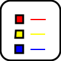

# Geometron 5

Link back up a level:

In order to learn the Geometron language  you should have a Geometron keyboard, decorated with a subset of the following symbols:

To start learning Geometron click on the Geometron icon from this page which looks like this:

Then move the cursor around by using the keys "asdfghjk".  The cursor looks like this:

As you type, symbol glyphs appear in the spelling field of the screen. Use arrow keys and delete or backspace key(probably backspace, try that first) to move through the symbols and edit.  Try doing some motions, then deleting them.  The cursor movements have symbols that look like this:

The symbols for the edit actions are:

Now try adding the drawing actions, circle, arc, square etc, using the keys shown here "zxcvbp]\":

Draw things, delete them, try editing what you draw.  By now you should see how Geometron works: it is a language that consists of sequences of discrete geometric actions, like move, rotate, scale etc.  This should be enough to make some basic shapes, like the one you start out with, some simple sets of circles.  To save your graphics, click the "save" icon which looks as it does for the Geometron Map editor:

When you've saved your symbol you can go see the file on the Symbol Feed, which you get to by clicking on its icon which looks like this:

Note that you can always delete whatever you draw by clicking the delete icon which looks like this:

To save your file right click on it on your browser and save it locally. You will always see two image in the feed when you save an image, one of which is in svg format the other is in png.  The png is a bit map and the svg is vector graphics.  But the an important fact for Geometron is that the svg files saved using this system save both the symbol and all the code that describes what you drew using the Geometron language.  So you can always edit any file made using this system on any other server running Geometron.  To edit an svg, click on it, then click the edit button from the Feed:

And go back to the main edit screen.  If you want to do this on a file from another server, go to that servers feed, download the file, then use the file uploader to upload it to the feed on your server.  Then click on it, hit the edit button and go to the main edit page to edit it on your server.  Hence, as in the initial discussion of organic media in the Geometron network, all files can be edited, replicated, and deleted quickly across the whole Web from sever to sever if many computers are running this software.  

Next we can play with styles, colors and layers.  There are 8 layers in Geometron, each of which has its own linewidth, line color and fill color the user can set.  To change layers use the upper-case commands across the top row of a qwerty keyboard:

Now we can dig into what is really the heart of Geometron: symmetries and scales.  Symmetry sets what the rotation angle is of the cursor.  The most common ones are 4 fold(90 degrees), fivefold(72 degrees) and sixfold(60 degrees).  Then there are actions which divide the angle by 2, multipley by 2, divide by 3 and multiply by 3.  These commands are as follows:

The "scale" in Geometron is 

Edit code using: [editor.php](editor.php)

