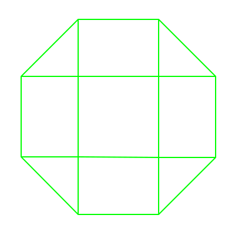

#  [Symbol Magic](index.html)

## 🧙 ⭐ 🍄

    Symbol: Geometry with meaning

    Magic: Replication of desire

[Link Back to Symbol Editor](index.html)

To operate the symbol editor using a keyboard(on laptop or desktop instead of mobile or tablet), paint these shapes on the keys of a keyboard and use them:

On mobile touch screen buttons are used to edit symbol. Symbols are not saved.  To save a symbol take a screen shot.  Symbols can be made with either physical Shape Set pictured here or [web app](index.html).

To communicate with other people using Symbol Magic, convert the domain name associated with this page to a hashtag by using the format [domain]dot[top level domain], e.g. www.symbolmagic.com goes to #symbolmagicdotcom and www.minasmorgul.xyz would go to the hashtag #minasmorguldotxyz.  Create symbols online or using physical media with Shape Set in public spaces, share the media, share the geometry.  

Follow the hashtag on social media(primarily [instagram](https://www.instagram.com/)).  Twitter hashtags can be used the same way. Use the hashtag to find other people using this local channel, as well as physical stations where publicly available Shape Sets, arts and craft supplies can be found.  To create a new page in a new place follow the instructions to create a new page below.  

To learn how to create and share meaningful symbols using Symbol Magic, take a class from someone you find using the above channels(including finding people in physical locations).  

### Instructions to replicate Symbol Magic:

Choose a domain name based on your public physical location(not an exact address).  Choose a top level domain other than .com like .xyz, .net or .org.  Create a hashtag based on that domain, spelling out the word "dot" e.g. #brandywinebridgedotxyz or #minasmorguldotnet.  Buy the domain, get hosting either on a paid host like [dreamhost](https://www.dreamhost.com/) or a free host like [000webhost](https://www.000webhost.com/), create a new file in the main web directory for your new domain in your hosting account called "replicator.php", and copy the code from [the local replicator file from this web page](php/replicator.txt) to the new site.  Point a browser to [www.yournewdomainname.xyz]/replicator.php, click through on the links, and you have replicated this page to a new place, which has a new hashtag. Create physical media using the Golden Triangle which has the hashtag and domain for this place and distribute publicly along with physical Golden Triangles.  

To make a shape set, order from the laser cut on demand company [Ponoko.com](https://www.ponoko.com).  Download the file used to create them here:

 When you upload to ponoko.com you'll need to specify the width of the file, that is 6 inches to make shapes that are 3 inches on a side.  Select neon green transluscent acrylic, 0.12 inches thick.   Note the "etch" layer is the one with the small details (red) and the "cut" layer is just the outlines.  This shape can also be printed out using a public laser cutter in the maker space of a public library.  Check your local public library for laser cutter availability and look for when the safety training class is.  For more information on how to laser cut or for an existing shape set contact whoever set this page up by following the Instagram hashtag as described above and direct messaging someone who's using the hashtag( called a local channel).  The Instagram feed will also have links to physical installations which might have free public shape sets you can use to create symbols.

Anyone who knows the system can run classes for free or for money, and can train anyone else to run classes.  Anyone who knows the system can create physical media based on self-replicating symbols which can carry any meaning: anything you might desire from a symbol can be encoded into some physical media with a symbol made from the language presented here.  

